# Deployment

Diese Anleitung beschreibt, wie die Streamlit-Anwendung bereitgestellt werden kann. Sie dokumentiert nur Informationen,
die aus dem Repository hervorgehen, und ergänzt vorsichtige Hinweise für typische Streamlit-Deployments.

## Deployment-Überblick

Wichtige Projektangaben:

- Streamlit-Einstiegspunkt: [`../app.py`](../app.py)
- Branch: `main`
- Python-Abhängigkeiten: [`../requirements.txt`](../requirements.txt)
- Systempakete: [`../packages.txt`](../packages.txt)
- Streamlit-Konfiguration: [`../.streamlit/config.toml`](../.streamlit/config.toml)
- Streamlit-Secrets für GitHub-Issues: `GITHUB_OWNER`, `GITHUB_REPO`, `GITHUB_TOKEN`

## Lokale Ausführung als Deployment-Vorprüfung

Vor jeder Bereitstellung sollte die App lokal gestartet werden:

```bash
python -m streamlit run app.py
```

Zusätzlich kann ein Compile-Check ausgeführt werden:

```bash
python -m compileall -q app.py core pages scripts
```

Wenn die App lokal nicht startet, sollte sie nicht deployed werden.

## Streamlit Community Cloud

Für eine Bereitstellung in Streamlit Community Cloud oder einer vergleichbaren Streamlit-Hosting-Umgebung sind diese Angaben relevant:

```text
Repository: dieses GitHub-Repository
Branch: main
Main file path: app.py
```

Die Datei `requirements.txt` muss im Repository vorhanden bleiben, damit die Python-Abhängigkeiten installiert werden können.

Falls die Hosting-Umgebung Systempakete unterstützt, kann `packages.txt` für die dort aufgeführten Linux-Pakete genutzt werden. Diese Pakete sind insbesondere für browserbasierte Exporte mit Plotly/Kaleido relevant.

## Streamlit-Konfiguration

Die vorhandene Datei `.streamlit/config.toml` enthält:

```toml
[client]
showSidebarNavigation = false

[theme]
primaryColor = "#84B819"
```

Die eingebaute Streamlit-Seitennavigation ist deaktiviert. Die App rendert ihre Navigation selbst in `app.py`. Diese Datei sollte deshalb beim Deployment mit ausgeliefert werden.

## Secrets

Die App benötigt für die normale Erhebung, Auswertung und den Export keine GitHub-Secrets.

Nur die optionale Funktion zum Erstellen von GitHub-Issues aus der Priorisierung erwartet Streamlit-Secrets. Dafür werden diese Werte benötigt:

```toml
GITHUB_OWNER = "..."
GITHUB_REPO = "..."
GITHUB_TOKEN = "..."
```

Bedeutung:

- `GITHUB_OWNER`: GitHub-Owner oder Organisation des Ziel-Repositorys
- `GITHUB_REPO`: Name des Ziel-Repositorys
- `GITHUB_TOKEN`: Token mit Berechtigung zum Lesen und Schreiben von Issues

Für dieses Repository ergeben sich Owner und Repository-Name aus der Remote-URL `https://github.com/aldebsmouaiad/unidoku.git`:

```toml
GITHUB_OWNER = "aldebsmouaiad"
GITHUB_REPO = "unidoku"
GITHUB_TOKEN = "github_pat_..."
```

Wichtig:

- Secrets niemals in das Repository committen.
- `.streamlit/secrets.toml` ist durch `.gitignore` ausgeschlossen.
- Ein GitHub-Token ist mit einem Passwort vergleichbar.
- Der Token sollte nur die Berechtigungen besitzen, die tatsächlich benötigt werden.

## GitHub-Token einrichten

Damit die Streamlit-Anwendung Maßnahmen als GitHub-Issues im ausgewählten Repository speichern kann, benötigt sie eine
sichere Authentifizierung gegenüber der GitHub-API. Dafür wird ein Fine-grained Personal Access Token verwendet.

Dieser Token lässt sich gezielt auf ein einzelnes Repository und die tatsächlich erforderlichen Berechtigungen
begrenzen. Für den Maßnahmenpool benötigt die Anwendung nur die Berechtigung, Issues im ausgewählten Repository zu
lesen und zu erstellen beziehungsweise zu bearbeiten.

Wichtig: Ein GitHub-Token darf weder im Quellcode noch im GitHub-Repository, in der Dokumentation oder auf öffentlich sichtbaren Screenshots veröffentlicht werden.

### 1. Token-Verwaltung öffnen

1. Bei GitHub anmelden.
2. Oben rechts auf das Profilbild klicken.
3. `Settings` auswählen.
4. Im linken Menü `Credentials` öffnen.
5. `Fine-grained personal access tokens` auswählen.
6. Auf `Generate new token` klicken.

Die GitHub-E-Mail-Adresse muss verifiziert sein, bevor ein Personal Access Token erstellt wird.

Falls `Credentials` in der GitHub-Oberfläche nicht angezeigt wird, führt der offizielle GitHub-Pfad über `Settings` -> `Developer settings` -> `Personal access tokens` -> `Fine-grained tokens`.

Alternativ kann die Token-Verwaltung direkt geöffnet werden:

```text
https://github.com/settings/personal-access-tokens
```

<details>
<summary>Screenshots zu Schritt 1: Token-Verwaltung öffnen</summary>

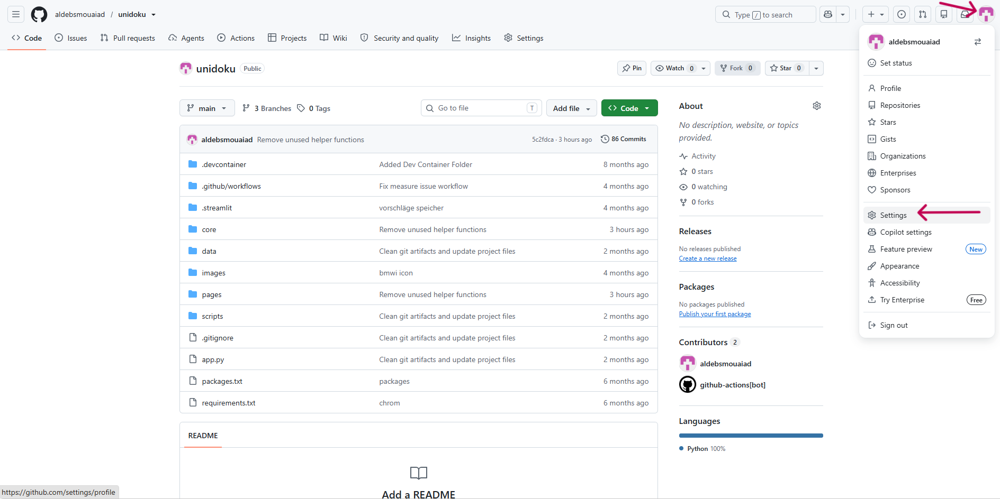

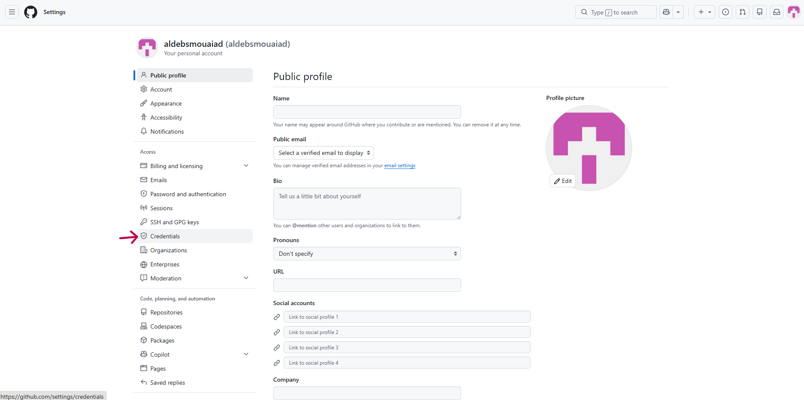

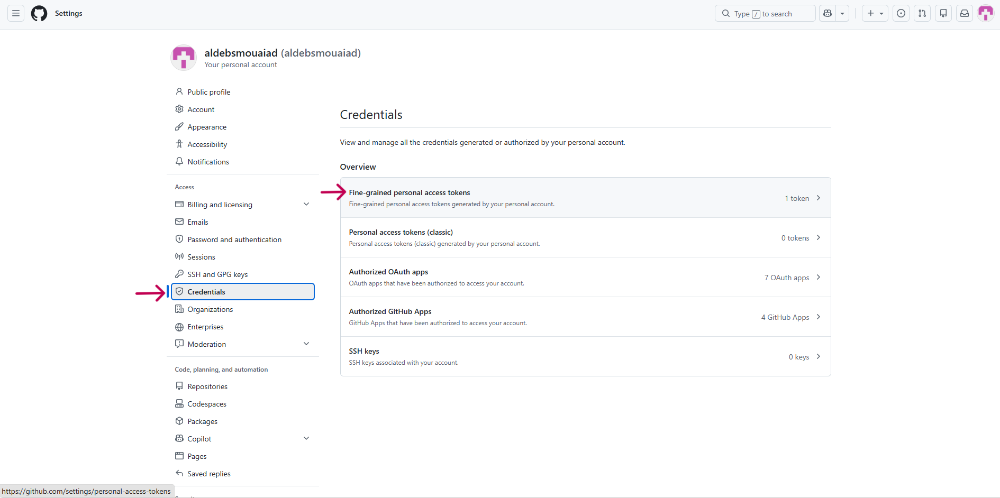

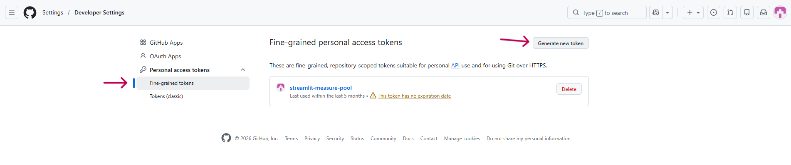

</details>

### 2. Grundeinstellungen festlegen

Empfohlene Angaben:

```text
Token name: Reifegradmodell-Massnahmenpool
Description: Erstellt Maßnahmen als Issues aus der Streamlit-App
Resource owner: GitHub-Konto oder Organisation des Ziel-Repositorys
Expiration: ein angemessenes Ablaufdatum festlegen
```

Ein Token ohne Ablaufdatum funktioniert ebenfalls, ist aus Sicherheitsgründen aber nicht zu empfehlen. Nach Ablauf muss ein neuer Token erstellt und in Streamlit hinterlegt werden.

<details>
<summary>Screenshot zu Schritt 2: Basisdaten, Ablaufdatum und Repository-Auswahl</summary>

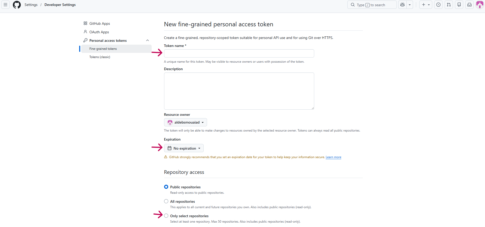

</details>

### 3. Repository auswählen

Unter `Repository access` die Option `Only select repositories` auswählen.

Danach über `Select repositories` ausschließlich das Repository auswählen, in dem die Maßnahmen als Issues gespeichert werden sollen.

Für dieses Projekt:

```text
aldebsmouaiad/unidoku
```

Dadurch kann der Token nicht auf andere private Repositorys des GitHub-Kontos zugreifen.

<details>
<summary>Screenshot zu Schritt 3: Repository auswählen</summary>

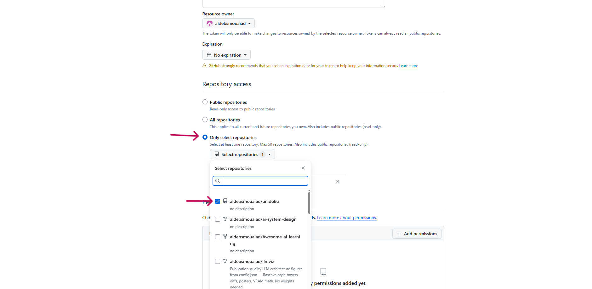

</details>

### 4. Erforderliche Berechtigung hinzufügen

Unter `Permissions` im Bereich `Repository permissions` über `Add permissions` diese Berechtigung hinzufügen:

```text
Issues: Read and write
```

Die Berechtigung `Metadata: Read-only` wird von GitHub normalerweise automatisch ergänzt. Weitere Berechtigungen sind für das Erstellen und Bearbeiten von Issues in dieser App nicht erforderlich.

Achtung: Ein Token mit `0 Repository permissions` kann keine Issues erstellen. Vor dem Erzeugen des endgültigen Tokens muss deshalb unbedingt `Issues: Read and write` gesetzt sein.

<details>
<summary>Screenshots zu Schritt 4: Issues-Berechtigung setzen</summary>

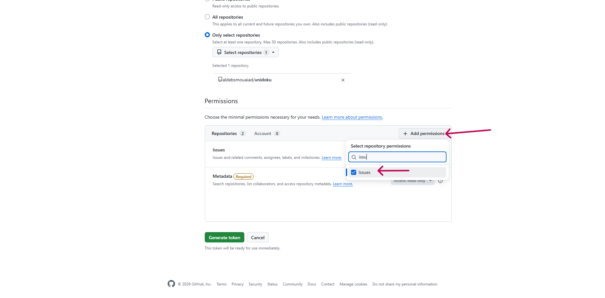

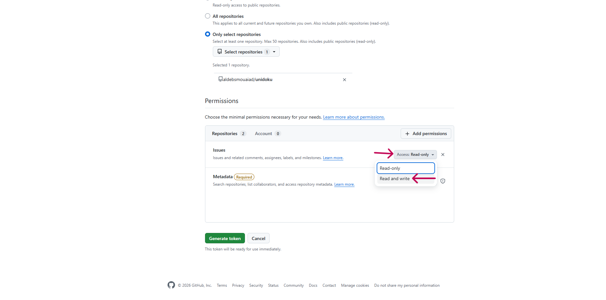

</details>

### 5. Token erzeugen und kopieren

Nach der Kontrolle der Einstellungen unten auf `Generate token` klicken. Falls GitHub eine Sicherheitsabfrage anzeigt, die Erstellung erneut bestätigen.

Der anschließend angezeigte Token beginnt üblicherweise mit:

```text
github_pat_...
```

Der Token muss sofort über das Kopiersymbol kopiert und sicher aufbewahrt werden. GitHub zeigt ihn später nicht noch einmal vollständig an.

<details>
<summary>Screenshots zu Schritt 5: Token erzeugen, bestätigen und kopieren</summary>

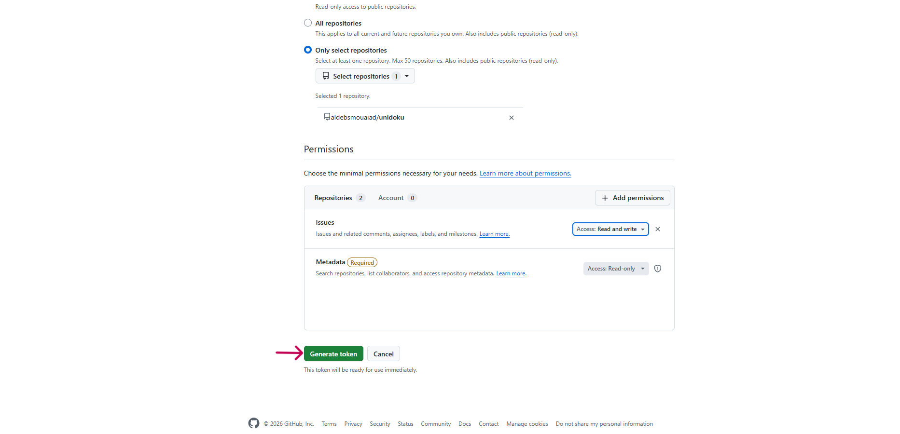

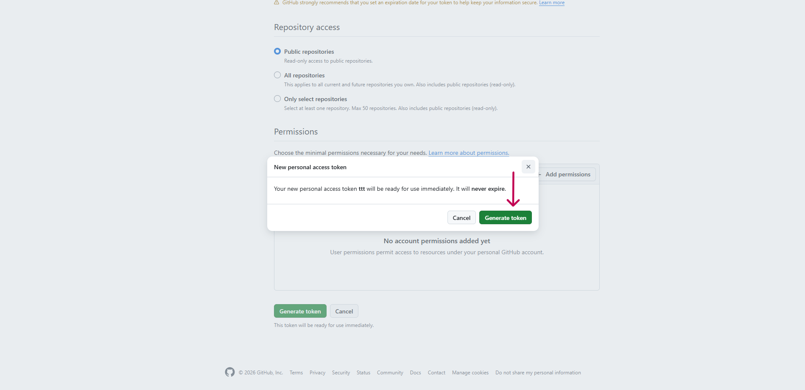

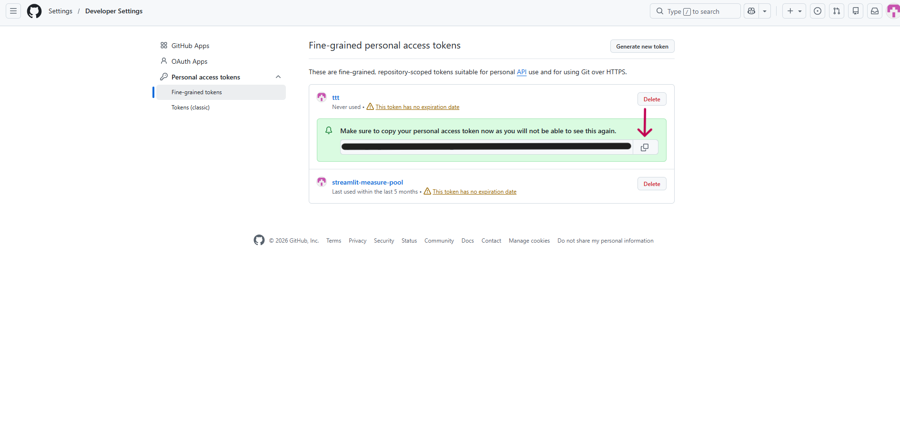

</details>

### 6. Token in Streamlit Community Cloud hinterlegen

Der Token darf nicht direkt in `app.py` oder einer anderen Projektdatei gespeichert werden. Stattdessen wird er als Streamlit Secret eingerichtet:

1. In Streamlit Community Cloud die entsprechende App öffnen.
2. Rechts neben der App das Drei-Punkte-Menü öffnen.
3. `Settings` auswählen.
4. Den Bereich `Secrets` öffnen.
5. Die Secrets im TOML-Format eintragen.
6. Auf `Save changes` klicken.
7. Falls erforderlich, die Streamlit-App neu starten.

Beispiel für dieses Repository:

```toml
GITHUB_OWNER = "aldebsmouaiad"
GITHUB_REPO = "unidoku"
GITHUB_TOKEN = "github_pat_HIER_DEN_TOKEN_EINTRAGEN"
```

<details>
<summary>Screenshots zu Schritt 6: Streamlit-Secrets eintragen</summary>

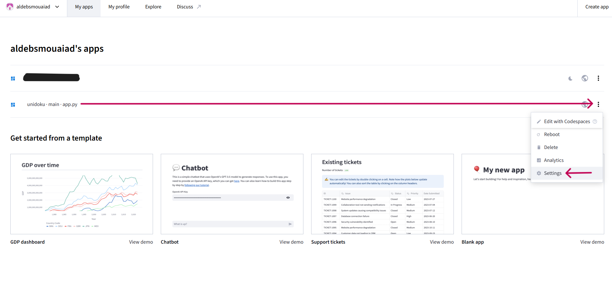

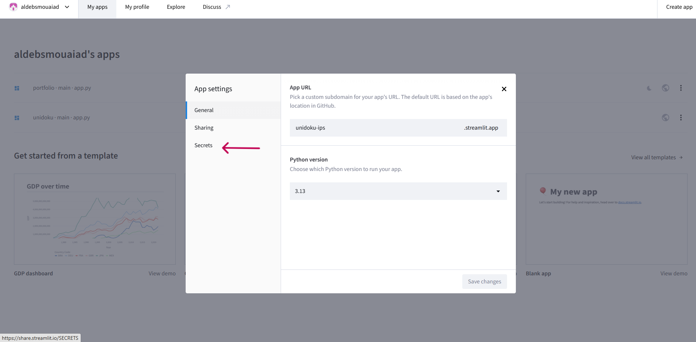

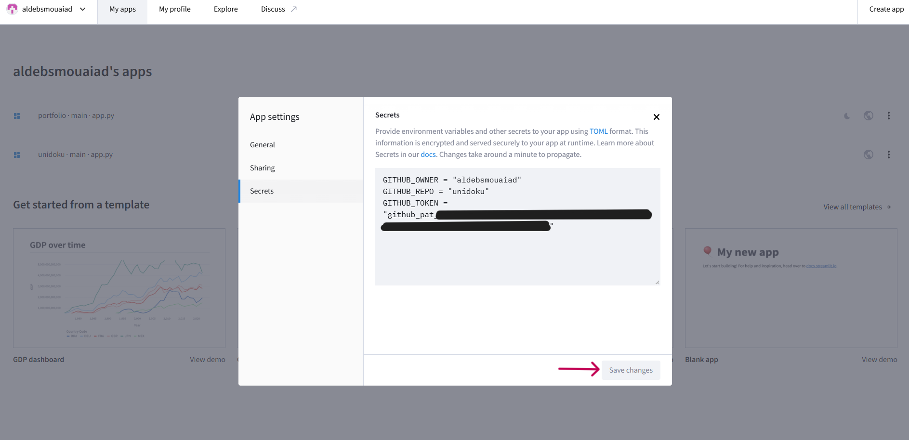

</details>

Die Anwendung liest diese Werte im Python-Code über `st.secrets`:

```python
import streamlit as st

github_token = st.secrets["GITHUB_TOKEN"]
github_owner = st.secrets["GITHUB_OWNER"]
github_repo = st.secrets["GITHUB_REPO"]
```

### 7. Lokale Entwicklung

Für die lokale Ausführung werden die Zugangsdaten in dieser Datei gespeichert:

```text
.streamlit/secrets.toml
```

Beispiel:

```toml
GITHUB_OWNER = "aldebsmouaiad"
GITHUB_REPO = "unidoku"
GITHUB_TOKEN = "github_pat_HIER_DEN_TOKEN_EINTRAGEN"
```

Damit diese Datei nicht versehentlich zu GitHub hochgeladen wird, ist sie in `.gitignore` eingetragen:

```text
.streamlit/secrets.toml
```

### 8. Screenshot-Dateien

Die eingebundenen Screenshots liegen unter `docs/assets/github-token/`. Die Zuordnung der Bildnummern ist in der Datei [`assets/github-token/README.md`](assets/github-token/README.md) dokumentiert.

## Datenhaltung und temporäre Snapshots

Die App verwendet `st.session_state` und zusätzlich serverseitige Snapshot-Dateien aus `core/persist.py`.

Standardmäßig werden Snapshots im temporären Verzeichnis des Systems unter `rgm_state` gespeichert. Der Speicherort kann über die Umgebungsvariable `RGM_STATE_DIR` geändert werden.

Für Deployments ist wichtig:

- Temporäre Dateisysteme können bei Neustarts, Rebuilds oder Plattformwechseln geleert werden.
- Snapshots sind nicht als dauerhaftes Datenbank- oder Backup-System zu verstehen.
- Je nach Hosting-Umgebung können mehrere Nutzer denselben Serverprozess oder dasselbe temporäre Dateisystem teilen.
- Für produktive Nutzung sollte ein Datenschutz- und Löschkonzept definiert werden.

Wenn serverseitige Snapshots nicht gewünscht sind, muss die Persistenzlogik in `core/persist.py` fachlich und technisch angepasst werden. Die vorhandene Konfiguration bietet dafür keine reine Schalteroption.

## GitHub-Actions-Automatisierung

Das Repository enthält den Workflow [`../.github/workflows/process-measure-issues.yml`](../.github/workflows/process-measure-issues.yml).

Dieser Workflow:

- reagiert auf neu geöffnete Issues,
- läuft nur bei Issues mit Label `measure:pending`,
- führt `scripts/process_measure_issue.py` aus,
- aktualisiert bei Bedarf `data/measures.json`,
- committet und pusht die Änderung,
- kommentiert und schließt das Issue.

Dieser Workflow ist kein Deployment-Workflow. Er veröffentlicht die Streamlit-App nicht.

## Aktualisierung nach einem Push

Typischer Ablauf:

```bash
git status
python -m compileall -q app.py core pages scripts
git add .
git commit -m "Dokumentation aktualisieren"
git push
```

Bei einem Streamlit-Hosting, das direkt mit GitHub verbunden ist, wird die App in der Regel nach einem Push auf den
konfigurierten Branch neu gebaut oder aktualisiert. Das konkrete Verhalten hängt von der Hosting-Umgebung ab.

## Devcontainer und Codespaces

Das Repository enthält [`../.devcontainer/devcontainer.json`](../.devcontainer/devcontainer.json).

Der Devcontainer verwendet ein Python-3.11-Image und führt beim Start Installationsschritte für `packages.txt` und `requirements.txt` aus.

Der dort konfigurierte Startbefehl lautet:

```bash
streamlit run app.py --server.enableCORS false --server.enableXsrfProtection false
```

Dieser Befehl ist für die Devcontainer-/Codespaces-Umgebung vorgesehen. Für lokale Nutzung und allgemeines Deployment reicht normalerweise:

```bash
python -m streamlit run app.py
```

## Typische Deployment-Probleme

### Falscher Einstiegspunkt

Die Startdatei muss `app.py` sein. Die Dateien unter `pages/` werden über `app.py` geladen und sind nicht der direkte Deployment-Einstiegspunkt.

### Fehlende Abhängigkeiten

Prüfen, ob `requirements.txt` im Deployment enthalten ist und installiert wird.

### Fehler bei PDF- oder PNG-Exporten

Bei Linux-basierten Deployments können Systempakete aus `packages.txt` nötig sein. Besonders betroffen sind Plotly/Kaleido-Exporte.

### GitHub-Issue-Funktion schlägt fehl

Prüfen:

- Sind `GITHUB_OWNER`, `GITHUB_REPO` und `GITHUB_TOKEN` gesetzt?
- Darf der Token Issues im Ziel-Repository erstellen?
- Existiert das Ziel-Repository?
- Werden Issues mit dem Label `measure:pending` vom Workflow verarbeitet?

### Zwischenstände verschwinden nach Neustart

Das kann passieren, wenn die Hosting-Plattform temporäre Dateien löscht oder die App neu startet. Für dauerhafte Wiederverwendung ist der JSON-Zwischenstand-Export verlässlicher als serverseitige Temp-Snapshots.

### App zeigt keine Streamlit-Standardnavigation

Das ist beabsichtigt. `.streamlit/config.toml` setzt `showSidebarNavigation = false`, weil die App eine eigene Navigation rendert.
