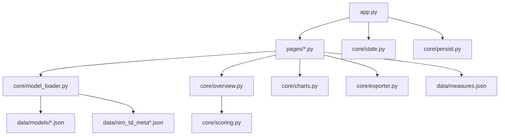
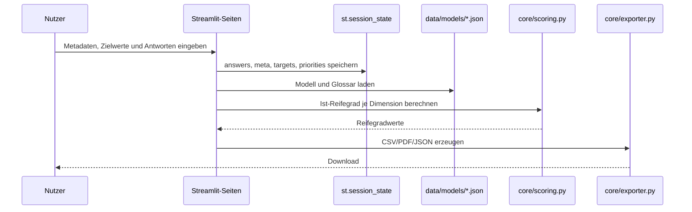

# Entwicklung

Diese Dokumentation richtet sich an Entwicklerinnen und Entwickler, die die Streamlit-App warten, erweitern oder
fachlich anpassen möchten. Sie beschreibt die aktuelle Architektur, zentrale Module, Datenflüsse, Entwicklungsbefehle
und bekannte technische Einschränkungen.

## Einstieg

Relevante Einstiegsdateien:

- [`../app.py`](../app.py): Streamlit-Einstiegspunkt, globale App-Konfiguration, Navigation und Page-Dispatching
- [`../requirements.txt`](../requirements.txt): Python-Abhängigkeiten
- [`../packages.txt`](../packages.txt): optionale Linux-Systempakete für browserbasierte Exporte
- [`../.streamlit/config.toml`](../.streamlit/config.toml): Streamlit-Konfiguration
- [`../README.md`](../README.md): Projektüberblick und Schnellstart
- [`INSTALLATION.md`](INSTALLATION.md): lokale Installation
- [`CONFIGURATION.md`](CONFIGURATION.md): fachliche und technische Konfiguration
- [`DEPLOYMENT.md`](DEPLOYMENT.md): Bereitstellung

Lokaler Start:

```bash
python -m streamlit run app.py
```

Minimaler Syntax-/Compile-Check:

```bash
python -m compileall -q app.py core pages scripts
```

## Architekturüberblick

Die Anwendung ist eine klassische Streamlit-App mit einem zentralen Einstiegspunkt und mehreren Page-Modulen.



`app.py` übernimmt die übergreifende App-Hülle. Die einzelnen Seiten liegen unter `pages/` und werden nicht durch Streamlits Standardnavigation genutzt, sondern dynamisch durch `app.py` geladen.

## Modulverantwortlichkeiten

### App-Einstieg

[`../app.py`](../app.py)

- setzt `st.set_page_config`
- initialisiert Sprache, Datenschutzdialog, Theme und Navigation
- lädt Page-Module über `load_page_module`
- definiert die sichtbaren Seiten in `PAGES`
- stellt die zentrale Navigation bereit
- ruft am Ende `persist.save(aid)` auf

### Core-Module

[`../core/state.py`](../core/state.py)

- setzt Standardwerte in `st.session_state`
- definiert Schlüssel wie `answers`, `meta`, `dimension_targets`, `priorities`, `language` und Erhebungsnavigation

[`../core/persist.py`](../core/persist.py)

- kapselt Query-Parameter-Zugriffe
- erzeugt und erhält die Assessment-ID `aid`
- speichert und lädt serverseitige Snapshot-Dateien
- exportiert und importiert JSON-Zwischenstände
- unterstützt die Schemas `rgm_snapshot_v2` und `rgm_export_v1`

[`../core/model_loader.py`](../core/model_loader.py)

- lädt lokalisierte Modell- und Metadaten-Dateien
- nutzt `st.cache_data`
- verhindert veraltete Streamlit-Caches über Dateigröße und Änderungszeit als Cache-Token

[`../core/scoring.py`](../core/scoring.py)

- enthält die Antwort-Scores
- berechnet den Ist-Reifegrad je Dimension
- behandelt `Nicht anwendbar`, unbeantwortete Fragen und Rundung

[`../core/overview.py`](../core/overview.py)

- baut aus Modell, Antworten, Zielwerten und Prioritäten eine normalisierte `pandas.DataFrame`-Übersicht
- sortiert Dimensionen natürlich nach Codes wie `TD1.1`, `TD2.10`, `OG3.2`

[`../core/maturity.py`](../core/maturity.py)

- berechnet Durchschnittswerte für Gesamt, TD und OG
- berücksichtigt nur bewertete beziehungsweise gültige Ist-Reifegrade

[`../core/charts.py`](../core/charts.py)

- erzeugt Radar-Diagramme für Ist-/Soll-Reifegrade
- wird im Dashboard und in der Gesamtübersicht verwendet

[`../core/exporter.py`](../core/exporter.py)

- bereitet Ergebnisdaten für den Export auf
- erzeugt CSV-Dateien
- erzeugt PDF-Berichte mit ReportLab
- rendert Plotly-Diagramme für PDF über Kaleido

[`../core/i18n.py`](../core/i18n.py)

- enthält UI-Übersetzungen für Deutsch und Englisch
- übersetzt Antwort-, Ziel- und Prioritätswerte für die Anzeige

[`../core/types.py`](../core/types.py)

- enthält Dataclasses für Modellstrukturen
- wird aktuell ergänzend genutzt; viele Datenflüsse arbeiten direkt mit Dicts aus JSON

### Page-Module

[`../pages/00_Start.py`](../pages/00_Start.py)

- Startseite mit Tool-Metadaten, Funktionen und Logos

[`../pages/00_Einfuehrung.py`](../pages/00_Einfuehrung.py)

- Einführung zum Reifegradmodell

[`../pages/00_Ausfuellhinweise.py`](../pages/00_Ausfuellhinweise.py)

- Hinweise zur Beantwortung und Interpretation

[`../pages/01_Erhebung.py`](../pages/01_Erhebung.py)

- Metadatenformular
- Ziel-Reifegrade
- Import/Export von Zwischenständen und Zielwerten
- Fragenrendering
- Glossar-Verlinkung
- Footer-Navigation durch Dimensionen

[`../pages/02_Dashboard.py`](../pages/02_Dashboard.py)

- Ergebniszusammenfassung
- Radar-Diagramme
- Ergebnistabelle
- CSV-Export

[`../pages/03_Priorisierung.py`](../pages/03_Priorisierung.py)

- Maßnahmenpriorisierung
- Maßnahmenvorschläge aus `data/measures.json`
- optionale GitHub-Issue-Erstellung für neue Maßnahmen

[`../pages/04_Glossar.py`](../pages/04_Glossar.py)

- Suchbares Glossar
- Rücksprung zur Erhebung

[`../pages/05_Gesamtuebersicht.py`](../pages/05_Gesamtuebersicht.py)

- Gesamtübersicht mit KPIs, Diagrammen, Maßnahmen, Filtern und Exporten

### Skripte

[`../scripts/process_measure_issue.py`](../scripts/process_measure_issue.py)

- verarbeitet GitHub-Issue-Bodies mit `measure_text`, `dimension_code` und `language`
- aktualisiert `data/measures.json`
- wird vom Workflow `.github/workflows/process-measure-issues.yml` ausgeführt

## Datenfluss

Vereinfachter Ablauf der Erhebung:



Zentrale Datenquellen:

- Modell: `data/models/niro_td_model.json` und `data/models/niro_td_model_en.json`
- Metadaten: `data/niro_td_meta.json` und `data/niro_td_meta_en.json`
- Maßnahmen: `data/measures.json`
- UI-Texte: `core/i18n.py`
- Laufzeitdaten: `st.session_state`
- serverseitige Snapshots: temporäres Verzeichnis oder `RGM_STATE_DIR`

## Session-State

`core/state.py` initialisiert unter anderem:

```text
answers
global_target_level
dimension_targets
priorities
language
nav_page
erhebung_step
erhebung_dim_idx
erhebung_dim_idx_ui
erhebung_own_target_defined
meta
```

Wichtige Hinweise:

- Antworten werden über Frage-IDs gespeichert.
- Zielwerte können global oder dimensionsspezifisch sein.
- Prioritäten werden nach Dimensionscode gespeichert.
- `meta` enthält Angaben wie Organisation, Bereich, Kontakt und Datum.
- Neue Session-State-Keys sollten in `core/state.py` mit sinnvollen Defaults ergänzt werden.

## Persistenz und Import/Export

`core/persist.py` unterscheidet zwei JSON-Formate:

- `rgm_snapshot_v2`: interner serverseitiger Snapshot
- `rgm_export_v1`: herunterladbarer JSON-Zwischenstand

Serverseitige Snapshots werden standardmäßig im temporären Systemverzeichnis unter `rgm_state` gespeichert. Der Speicherort kann über `RGM_STATE_DIR` geändert werden.

Wichtig für Änderungen:

- Neue relevante Session-State-Felder müssen in `save`, `restore`, `export_snapshot_bytes` und `apply_snapshot_dict` berücksichtigt werden.
- Bei Schemaänderungen sollte Abwärtskompatibilität geprüft werden.
- Alte exportierte JSON-Dateien können sonst nicht mehr zuverlässig geladen werden.

## Scoring

Die Reifegradberechnung liegt in `core/scoring.py`.

Antwortwerte:

```text
Vollständig              -> 1.0
In den meisten Fällen    -> 0.75
In ein paar Fällen       -> 0.5
Gar nicht                -> 0.0
Nicht anwendbar          -> aus dem Nenner entfernen
```

Regeln:

- Unbeantwortete Fragen zählen als `0.0`.
- `Nicht anwendbar` wird nicht in den Nenner aufgenommen.
- Wenn Level 1 ausschließlich `Nicht anwendbar` ist, ergibt die Dimension `NaN`.
- Bei der ersten nicht vollständig erfüllten Stufe wird abgebrochen.
- Das Ergebnis wird auf 0,25-Schritte abgerundet.

Änderungen an Antwortwerten müssen mindestens in `core/scoring.py`, `pages/01_Erhebung.py` und `core/i18n.py` abgestimmt werden.

## Exporte

Vorhandene Exportwege:

- JSON-Zwischenstand über `core/persist.py`
- CSV über `core/exporter.py`
- PDF über `core/exporter.py`
- PNG-Downloads der Diagramme über die Diagramm-Ansichten

`core/exporter.py` nutzt ReportLab für PDF und Plotly/Kaleido für Diagrammbilder. Unter Linux können dafür Systempakete aus `packages.txt` nötig sein.

## GitHub-Issue-Verarbeitung

Die optionale Maßnahmenfreigabe funktioniert in zwei Teilen:

1. `pages/03_Priorisierung.py` erstellt ein GitHub-Issue mit Label `measure:pending`.
2. `.github/workflows/process-measure-issues.yml` ruft `scripts/process_measure_issue.py` auf.

Das Skript erwartet im Issue-Body:

```text
### measure_text
...

### dimension_code
TD1.1

### language
de
```

Der Workflow aktualisiert bei Bedarf `data/measures.json`, committet die Änderung und schließt das Issue.

## Neues Modell oder neue Fragen hinzufügen

Für Änderungen am vorhandenen Modell:

1. Deutsche Datei `data/models/niro_td_model.json` anpassen.
2. Englische Datei `data/models/niro_td_model_en.json` parallel anpassen.
3. Neue Dimensionscodes auch in `data/measures.json` ergänzen.
4. Frage-IDs eindeutig und stabil halten.
5. JSON-Dateien prüfen.
6. App lokal starten und Erhebung, Dashboard, Priorisierung und Gesamtübersicht prüfen.

Prüfbefehl:

```bash
python -c "import json, pathlib; [json.loads(p.read_text(encoding='utf-8')) for p in pathlib.Path('data').rglob('*.json')]; print('JSON OK')"
```

Wichtig: `core/model_loader.py` lädt aktuell feste Dateinamen für Deutsch und Englisch. Ein vollständig neues Modell mit eigenen Dateinamen erfordert daher Codeänderungen oder den Ersatz der vorhandenen Modell-Dateien.

## Neue UI-Texte hinzufügen

UI-Texte liegen in `core/i18n.py`.

Vorgehen:

1. Neuen Key in `TRANSLATIONS["de"]` ergänzen.
2. Denselben Key in `TRANSLATIONS["en"]` ergänzen.
3. Text über `t("key.name")` abrufen.
4. App in beiden Sprachen prüfen.

Die Übersetzungen sollten dieselbe Key-Menge in Deutsch und Englisch behalten.

## Entwicklungsregeln

- Keine Secrets committen.
- `.venv/` nicht committen.
- Bestehende Frage-IDs und Dimensionscodes nicht ohne Migrationsüberlegung ändern.
- Deutsche und englische Modell-/Metadaten-Dateien parallel pflegen.
- Änderungen an Scoring, Exporten oder Persistenz immer mit bestehenden JSON-Zwischenständen gedanklich prüfen.
- Bei UI-Änderungen mehrere Seiten prüfen, weil globale und page-spezifische CSS-Blöcke zusammenspielen.
